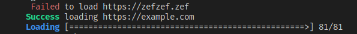

# progress_bar

This crate allows you to display a pretty progress bar in the terminal.

**LINUX ONLY**

## Example

```rust
use progress_bar::*;

// if you have 81 pages to load
init_progress_bar(81);
set_progress_bar_action("Loading", Color::Blue, Style::Bold);

for i in 0..81 {
    // load page
    sleep(Duration::from_millis(500));

    // log the result
    if i == 14 {
        print_progress_bar_info("Failed", "https://zefzef.zef", Color::Red, Style::Normal);
    } else if i == 41 {
        print_progress_bar_info("Success", "https://example.com", Color::Green, Style::Bold);
    }

    // update the progression by 1
    inc_progress_bar();
}

finalize_progress_bar();
```



License: MIT
# progress_bar

This crate allows you to display a pretty progress bar in the terminal.

**LINUX ONLY**

## Example

```rust
use progress_bar::*;

// if you have 81 pages to load
init_progress_bar(81);
set_progress_bar_action("Loading", Color::Blue, Style::Bold);

for i in 0..81 {
    // load page
    sleep(Duration::from_millis(500));

    // log the result
    if i == 14 {
        print_progress_bar_info("Failed", "https://zefzef.zef", Color::Red, Style::Normal);
    } else if i == 41 {
        print_progress_bar_info("Success", "https://example.com", Color::Green, Style::Bold);
    }

    // update the progression by 1
    inc_progress_bar();
}

finalize_progress_bar();
```


License: MIT
